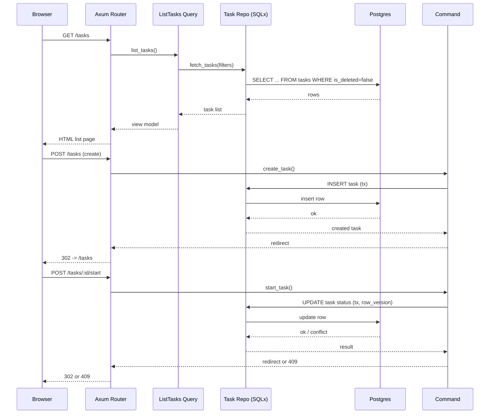

# Tasks Example Implementation (Tee Architecture)

This document describes how the bundled Tasks feature demonstrates the Tee System architecture in practice. It starts with UI behavior, shows an end-to-end flow, then details middleware, data modeling, and patterns that keep the implementation small, explicit, and compliant with the guidelines.

## UI Behavior (Functional)
- **List page:** Displays tasks with status/priority; supports filters (status, date range, priority) and sorting (updated_at, due_at, priority). Actions link to detail or creation.
- **Detail page:** Shows full task info, due date, priority, and lifecycle actions; disables mutations for completed/deleted tasks.
- **Create/Update forms:** Validate required fields and lengths; POST to commands and redirect on success.
- **Theme:** Layout supports light/dark via class toggling; no SPA dependency.

## Sequence: Task Lifecycle (Mermaid)

## HTTP Layer and Middleware
- **Routing:** `src/interface/routes_web.rs` wires routes for list, detail, create, update, lifecycle actions, and delete. Routes are HTML-first and map directly to command/query handlers.
- **Middleware stack:** Configured in `src/interface/http.rs`: request ID generation/propagation, compression, per-request timeout (10s), and 1 MiB body limit. This matches the guidelines' baseline protections.
- **Static assets:** Served from `/static` via `ServeDir`, keeping the UI assets co-located with the service.

## Request/Response Patterns
- **Server-rendered HTML:** Askama templates (`templates/*.html`) render list, detail, and form pages. PRG is used after successful POSTs.
- **Forms as commands:** HTML forms post to command endpoints; handlers return redirects to avoid resubmission.
- **Validation errors:** Input validation failures surface as `AppError::BadRequest` or command-specific messages, mapped to HTTP 400/409 as appropriate.

## Application Layer (Commands & Queries)
- **Commands:** `src/app/commands/*` handle create, update, start, complete, delete. Each command runs in an explicit transaction, enforces policy hooks, validates lifecycle rules, and increments `row_version` for optimistic concurrency.
- **Queries:** `src/app/queries/*` provide list and get. They are side-effect free, accept filters (status, date, priority), and apply default exclusion of soft-deleted tasks.
- **Policies:** `src/domain/policy.rs` provides the authorization seam (currently permissive). Real deployments replace these with principal-aware checks.

## Domain Layer
- **Types and invariants:** `src/domain/task.rs` and `src/domain/types.rs` define `Task`, `TaskStatus`, and typed IDs/values. Lifecycle validation is pure and reused by commands.
- **Immutability rules:** Completed or deleted tasks reject further mutations; enforced in domain logic and mirrored in SQL constraints.

## Data Layer and SQL
- **Repository:** `src/data/task_repo.rs` encapsulates all SQL for tasks. Parameterized queries and compile-time checking (via `cargo sqlx prepare`) ensure type safety without an ORM.
- **Schema:** `migrations/0001_create_tasks.sql` and `0002_task_lifecycle.sql` create `tasks` with status, timestamps, soft-delete flags, due date, priority, and `row_version` for concurrency.
- **Constraints & indexes:** CHECKs bound title length, status values, timestamps, soft-delete consistency, and priority range; partial indexes support active-task queries and sorting.
- **Pooling:** `src/data/db.rs` configures a bounded pool (max 10, 5s acquisition timeout).

## Observability
- **Logging/tracing:** `src/ops/observability.rs` sets structured logging with env-configured level. Request IDs from middleware propagate into traces/logs.
- **Deterministic errors:** `src/interface/error.rs` maps domain/app errors to stable HTTP responses (403, 404, 409, 400, 500).

## Patterns Demonstrated
- **Two-layer enforcement:** HTTP layer delegates to app/domain; SQL lives only in `data/`.
- **Command/Query split:** Mutations and reads are separate modules and routes.
- **Optimistic concurrency:** `row_version` guards updates; conflicts yield 409.
- **Soft delete:** Logical delete hides tasks from default queries without data loss.
- **Progressive enhancement ready:** JS optional; forms work without client-side code.

## Extensibility Seams
- Add migrations for schema changes; implement data access in `data/`; commands/queries in `app/`; routes/templates in `interface/`; update policies for auth.
- Background work should run as another mode of the same binary, sharing the pool and schema.

## Operational Notes
- Required env: `DATABASE_URL`; defaults provided for `BIND_ADDR` and `LOG_LEVEL`.
- Dev/test may auto-run migrations on startup; production should run migrations explicitly before starting the service.
- Keep `cargo sqlx prepare` metadata up to date to retain offline query checking.
