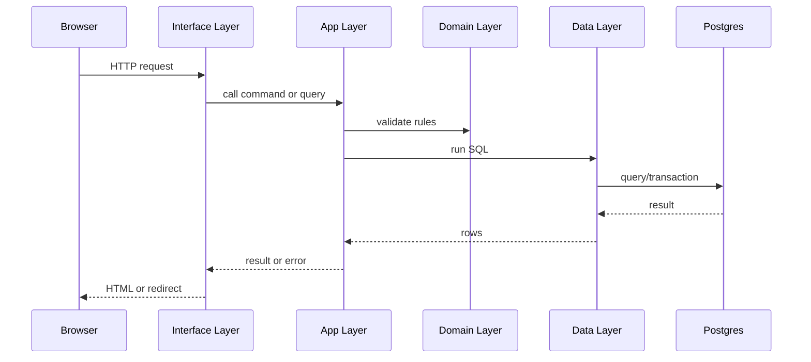

# Architecture Overview

The Tee system is built to be boring in the best way: simple to deploy, easy to
understand, and predictable under load. This chapter explains the big picture
before we dive into the Task screens.

## Two physical layers only

The Tee system runs as:
- One Rust service (the "Tee service").
- One Postgres database (the "Tee store").

No extra services are required. This is a deliberate design choice from
`docs/Tee-Architecture-Guidelines.md`.

## Logical layers inside the service

Even though the service is one binary, the code is split into logical layers:

```
Interface -> App -> Domain -> Data
```

- Interface: HTTP, templates, auth, i18n.
- App: commands and queries.
- Domain: business rules and types.
- Data: SQL and database access.

The rules are strict:
- Interface never talks to the database directly.
- Domain never uses HTTP or SQL types.
- Data never implements workflows or policies.

## Command and query split

Commands change data. Queries read data.
This is sometimes called "logical CQRS" (without extra infrastructure).

Examples:
- Command: start a task.
- Query: list tasks.

This split makes it clear where writes happen and where reads happen. It also
makes testing easier.

## Code examples from the real project

Router wiring and middleware live in `src/interface/http.rs`:

```rust
pub fn build_router(pool: sqlx::PgPool, auth: AuthSettings, translator: Translator) -> Router {
    Router::new()
        .merge(routes_web::router(pool, auth, translator))
        .nest_service("/static", ServeDir::new("static"))
        .layer(TraceLayer::new_for_http())
        .layer(CompressionLayer::new())
        .layer(TimeoutLayer::with_status_code(
            axum::http::StatusCode::REQUEST_TIMEOUT,
            Duration::from_secs(10),
        ))
        .layer(RequestBodyLimitLayer::new(1024 * 1024)) // 1 MiB
        .layer(PropagateRequestIdLayer::new(HeaderName::from_static(
            "x-request-id",
        )))
        .layer(SetRequestIdLayer::new(
            HeaderName::from_static("x-request-id"),
            MakeRequestUuid,
        ))
}
```

A command (write) example from `src/app/commands/create_task.rs`:

```rust
pub async fn handle(
    pool: &PgPool,
    principal: &Principal,
    cmd: CreateTaskCommand,
) -> Result<Uuid, CreateTaskError> {
    shared::ensure_authorized(
        policy::can_create_task(principal),
        CreateTaskError::NotAuthorized,
    )?;

    let title = TaskTitle::parse(&cmd.title_raw)?;
    let description = TaskDescription::parse(&cmd.description_raw)?;
    let priority = TaskPriority::parse(cmd.priority_raw.unwrap_or(3))?;
    let mut tx = pool.begin().await?;
    let id = task_repo::insert_task(
        &mut *tx,
        title.as_str(),
        description.as_str(),
        cmd.due_at,
        priority.as_i16(),
    )
    .await?;
    tx.commit().await?;
    tracing::info!(task_id = %id, "task created");
    Ok(id)
}
```

A query (read) example from `src/app/queries/list_tasks.rs`:

```rust
let params = task_repo::ListTasksParams {
    status: status_filter,
    created_after: query.created_after,
    created_before: query.created_before,
    search: query.search.as_deref(),
    priority: query.priority,
    sort: query.sort.as_deref(),
    limit: query.limit,
};
let rows = task_repo::list_tasks(pool, params).await?;
```

## Why this matters for juniors

When you are new, big codebases can feel confusing. The Tee system reduces
surprises by making every layer explicit. You always know:
- Where to add a new route.
- Where to add a new use case.
- Where to add a new SQL query.

## End-to-end flow (bird's eye)



## Exercise

Read `src/app/commands/create_task.rs` and identify:
- Where the authorization check happens.
- Where the transaction starts.
- Where SQL is called (hint: it is not in this file).

Next: Task List View.
