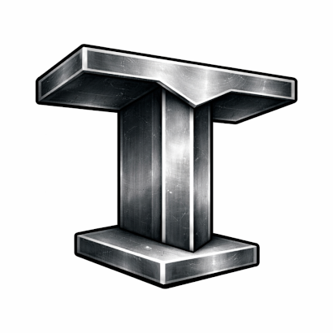

# Introduction

This guide is a slow, human-friendly walk through the Task example in the Tee system.
It is written for junior developers who know basic Rust but may be new to web services,
SQL, and layered architecture.

By the end, you should be able to:
- Explain how the Tasks UI works end to end.
- Trace a request from the browser to the database and back.
- Understand why the code is split into interface, app, domain, and data layers.
- Extend the system in safe, predictable ways.




## Who this guide is for

You should be comfortable with:
- Basic Rust syntax (structs, enums, impl blocks).
- Reading and running a Cargo project.
- Basic HTTP concepts (GET, POST, status codes).

You do not need to be an expert in Axum, SQLx, or Postgres. We will explain concepts
as they appear.

## How to read this guide

We start with what users see (the Task list and detail views), then move inward to
the system layers and infrastructure. This mirrors how most people learn: start with
a feature, then open the hood.

Sections include:
- Small code excerpts (never the full file).
- Diagrams for request flow.
- Exercises you can try on your own.

## What is the Tee system?

The Tee system is a simple, strict architecture:
- One Rust service.
- One Postgres database.

Inside the Rust service there are logical layers:
- Interface: HTTP routing and request handling.
- App: commands and queries.
- Domain: rules and types.
- Data: SQL and database access.

This keeps the system easy to reason about and easy to operate. There is no message
broker, no cache tier, and no separate read service.

## Repository layout (high level)

```
src/
  interface/   # HTTP routes, auth, templates, i18n
  app/
    commands/  # state-changing use cases
    queries/   # read-only use cases
  domain/      # domain logic and policies
  data/        # SQL and database access
migrations/    # schema changes
templates/     # Askama HTML templates
static/        # CSS and assets
locales/       # translation files
```

If this structure is new to you, do not worry. We will visit each folder in depth.

## Code example: service startup

This is the real entry point in `src/main.rs`. It shows the order of startup:
load config, initialize logging, connect to the database, run migrations,
load translations, build the router, and start the server.

```rust
mod app;
mod data;
mod domain;
mod interface;
mod ops;

use anyhow::Context;
use interface::i18n::{Translator, DEFAULT_LOCALE, REQUIRED_LOCALES};

#[tokio::main]
async fn main() -> Result<(), anyhow::Error> {
    let cfg = ops::config::Config::from_env().context("reading config")?;
    ops::observability::init(&cfg.log_level);

    let pool = data::db::new_pool(&cfg.database_url)
        .await
        .context("connecting to database")?;

    sqlx::migrate!("./migrations")
        .run(&pool)
        .await
        .context("running migrations")?;

    let translator = Translator::load_from_disk("locales", DEFAULT_LOCALE, REQUIRED_LOCALES)
        .context("loading translation bundles")?;

    let auth_settings = interface::state::AuthSettings::new(
        cfg.session_lifetime,
        cfg.session_idle_timeout,
        cfg.remember_me_lifetime,
    );
    let router = interface::http::build_router(pool, auth_settings, translator);

    let listener = tokio::net::TcpListener::bind(&cfg.bind_addr)
        .await
        .context("binding TCP listener")?;

    tracing::info!("listening on {}", cfg.bind_addr);

    axum::serve(listener, router)
        .await
        .context("serving HTTP")?;
    Ok(())
}
```

## Glossary (quick)

- Command: a function that changes state (create, update, delete).
- Query: a function that reads state without changing it.
- Transaction: a group of database operations that succeed or fail together.
- Soft delete: marking a row as deleted without removing it.
- Optimistic concurrency: rejecting updates if the data changed since you read it.

Next: Architecture Overview.
