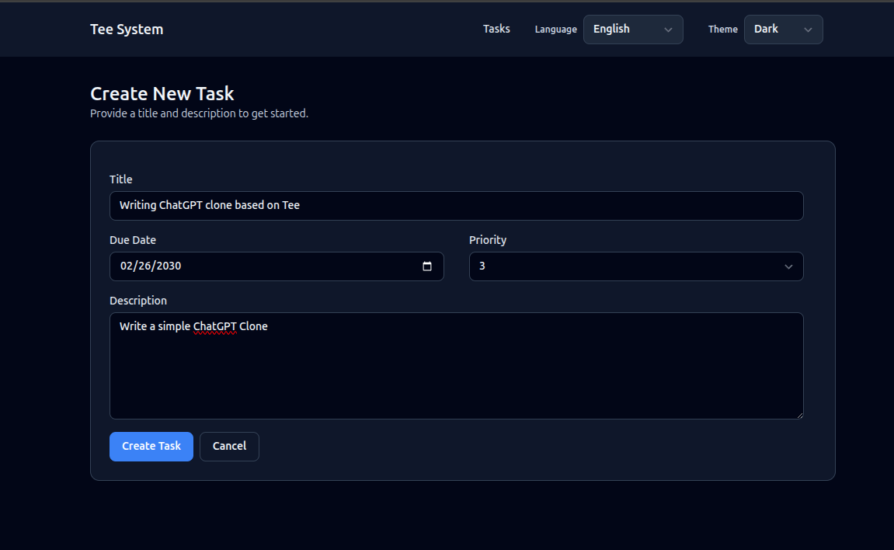

# Task Create and Update

This chapter covers how tasks are created and edited. These flows show how
validation, commands, and redirects work together.

## Create view

**User experience**
- A form with title, description, due date, and priority.
- Submit creates a task and redirects back to the list.

**Where it lives**
- Route: `GET /tasks/new` -> `task_new`
- Route: `POST /tasks` -> `tasks_create`
- Template: `templates/task_new.html`
- Command: `CreateTask` in `src/app/commands/create_task.rs`

**Image**
- PLACEHOLDER: Task create screen image.

**Task create screen image.**



## How the form works

The create form is a normal HTML form. When the user clicks the submit button:
1. The browser sends a POST request to `/tasks`.
2. The interface layer validates the input.
3. The create command runs inside a transaction.
4. The server responds with a redirect to `/tasks`.

This flow works without JavaScript and is easy to debug.

### Code example: handler builds a command

From `src/interface/routes_web.rs`:

```rust
let cmd = commands::create_task::CreateTaskCommand {
    title_raw: form.title,
    description_raw: form.description,
    due_at: parse_due_date(form.due_at.as_deref(), &invalid_due_msg)?,
    priority_raw: parse_priority(form.priority.as_deref(), &invalid_priority_msg)?,
};

commands::create_task::handle(&st.pool, &principal, cmd).await?;
Ok(Redirect::to("/tasks").into_response())
```

## Validation in the create flow

The handler converts raw strings into domain types:
- `TaskTitle::parse`
- `TaskDescription::parse`
- `TaskPriority::parse`

This keeps rules in one place and avoids validation drift.

Example from `CreateTask`:
```rust
let title = TaskTitle::parse(&cmd.title_raw)?;
let description = TaskDescription::parse(&cmd.description_raw)?;
let priority = TaskPriority::parse(cmd.priority_raw.unwrap_or(3))?;
```

## Update flow (detail page)

Updates happen in the detail view:
- Route: `POST /tasks/:id/update`
- Command: `UpdateTaskDetails` in `src/app/commands/update_task_details.rs`

Important rules:
- Completed tasks are read-only.
- Deleted tasks cannot be edited.
- Updates use optimistic concurrency.

### Code example: update with row_version check

From `src/app/commands/update_task_details.rs`:

```rust
let updated = task_repo::update_task_details(
    &mut *tx,
    cmd.id,
    &title,
    &description,
    cmd.due_at,
    priority.as_i16(),
    cmd.expected_row_version,
)
.await?;
if updated == 0 {
    return match shared::classify_update_conflict(&mut *tx, cmd.id).await? {
        UpdateConflict::NotFound => Err(UpdateTaskDetailsError::NotFound),
        UpdateConflict::Deleted => Err(UpdateTaskDetailsError::TaskDeleted),
        UpdateConflict::Conflict => Err(UpdateTaskDetailsError::ConcurrencyConflict),
    };
}
```

## PRG pattern (Post-Redirect-Get)

After a successful POST, the handler redirects instead of rendering HTML.
This prevents double submissions if the user refreshes the page.

Example:
```rust
commands::create_task::handle(&st.pool, &principal, cmd).await?;
Ok(Redirect::to("/tasks").into_response())
```

## Delete flow

Delete is a command that marks the task as deleted (soft delete).
It is idempotent: deleting an already deleted task is treated as success.

- Route: `POST /tasks/:id/delete`
- Command: `DeleteTask` in `src/app/commands/delete_task.rs`

## Exercise

- Add a "Save and view" option that redirects to `/tasks/:id` after create.
- Add a small confirmation dialog before delete (client-side only).

Next: Interface Layer.
