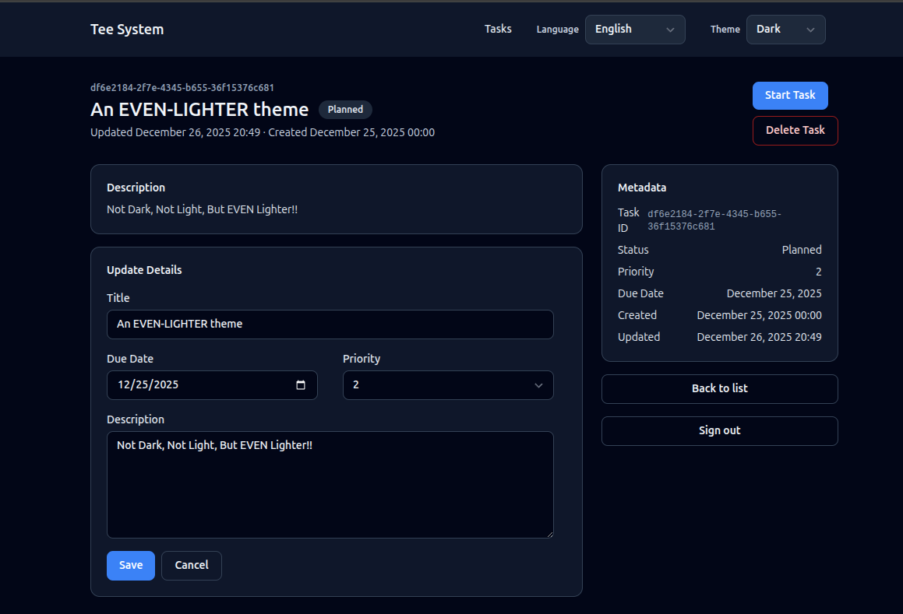
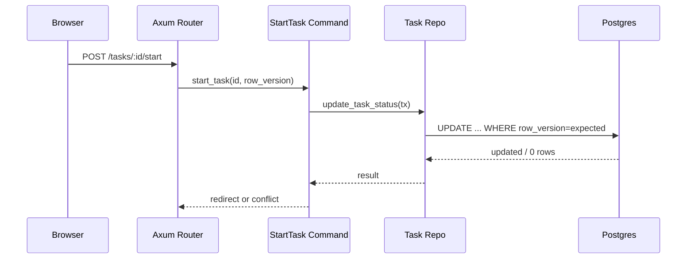

# Task Detail View

The Task detail view shows one task and lets the user act on it.
This is where commands (state changes) appear.

## What the user sees

- Title, description, status, and metadata (created, updated, due, priority).
- Buttons to start or complete a task, based on status.
- A form to update details.
- A button to delete the task.

**Task detail screen image**



## Route and handler

- Route: `GET /tasks/:id`
- Handler: `task_detail` in `src/interface/routes_web.rs`
- Template: `templates/task_detail.html`

The handler:
1. Checks authentication and CSRF availability.
2. Calls the get-task query.
3. Computes which actions are allowed.
4. Renders the template.

Example logic:
```rust
let task = queries::get_task::handle(&st.pool, &principal, id).await?;
let can_start = task.status == TaskStatus::Planned;
let can_complete = task.status == TaskStatus::InProgress;
let can_edit = task.status != TaskStatus::Completed;
```

## User interactions

The detail page supports several user actions:
- Start task
- Complete task
- Update details
- Delete task

Each action is a form submit (POST). The server validates CSRF, runs the command,
and redirects back to the appropriate page. This is the same PRG pattern you saw
in the create flow.

## Query layer

The detail view uses `GetTask` from `src/app/queries/get_task.rs`.
It reads a single task and returns a domain `Task`.

Important: deleted tasks are excluded by default using
`fetch_task_active` in `src/data/task_repo.rs`.

## Action buttons are commands

Buttons in the detail view post to command routes:
- `POST /tasks/:id/start` -> StartTask
- `POST /tasks/:id/complete` -> CompleteTask
- `POST /tasks/:id/update` -> UpdateTaskDetails
- `POST /tasks/:id/delete` -> DeleteTask

These routes live in `src/interface/routes_web.rs` and call the command handlers
in `src/app/commands/*`.

### Code example: status transition in StartTask

From `src/app/commands/start_task.rs`:

```rust
let mut tx = pool.begin().await?;
let row = shared::fetch_task_required(&mut *tx, cmd.id, StartTaskError::NotFound).await?;
let current = shared::parse_status(&row.status, StartTaskError::InvalidStatus)?;
if !can_transition_task(row.is_deleted, current, TaskStatus::InProgress) {
    if row.is_deleted {
        return Err(StartTaskError::TaskDeleted);
    }
    tracing::warn!(
        task_id = %cmd.id,
        from = %current,
        to = %TaskStatus::InProgress,
        "invalid task transition attempt"
    );
    return Err(StartTaskError::InvalidTransition);
}
```

## Optimistic concurrency (explained)

Each task has a `row_version` column. When you update or change status, the
command includes the expected row version. The SQL update is guarded by:

```
WHERE id = $id AND row_version = $expected_row_version
```

If another user updated the task first, the update affects 0 rows and the
command returns a conflict. This is optimistic concurrency.

Why it matters:
- It prevents accidental overwrites.
- It avoids heavy locking.

## Full flow: start task (Mermaid)



## Exercise

- Add a read-only badge to show the task ID in the detail template.
- Add a warning message if the task is completed (read-only mode).

Next: Task Create and Update.
