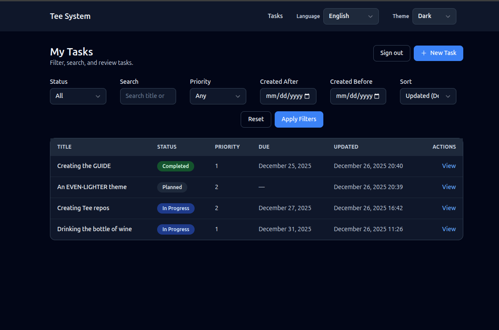
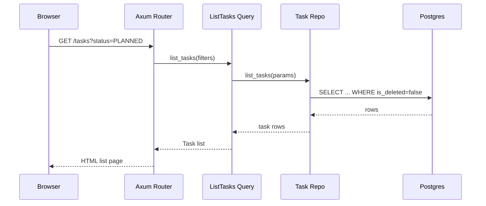

# Task List View

The Task list view is the home page of the example application. It introduces
most of the system in a safe, read-only way.

## What the user sees

- A list of tasks, each with title, status, priority, due date, and last updated.
- Filters for status, priority, and created date range.
- Sorting by updated date, due date, or priority.
- A primary action to create a new task.

**Task list screen image**



## Route and handler

The list view is served by:
- Route: `GET /tasks`
- Handler: `tasks_list` in `src/interface/routes_web.rs`
- Template: `templates/tasks_list.html`

The handler does four things in order:
1. Check authentication (must be logged in for the UI routes).
2. Read and validate query parameters (filters and sort).
3. Call the query layer to fetch tasks.
4. Render the template with a view model.

## How the page is rendered

This project uses server-rendered HTML. That means:
- The handler builds a Rust struct with all the data the template needs.
- Askama renders HTML on the server.
- The browser receives plain HTML.

There is no client-side framework that fetches data after page load. This keeps
the behavior predictable and fast to reason about.

## User interactions

When a user changes filters or sorting:
- The browser sends a new GET request with query parameters.
- The handler re-runs the query with those filters.
- A new HTML page is returned.

This is simple but powerful. It works even if JavaScript is disabled.

## Filtering and validation (explained)

Look at the handler in `src/interface/routes_web.rs`. It uses helper functions to
parse and validate filters:
- `parse_date_filter` for created dates.
- `parse_priority` for priority range.
- `TaskStatus::parse` for status.

Why validate here?
- The handler is the boundary where raw strings become typed values.
- The query layer assumes already-validated input.

## Query layer: read-only by design

The handler builds a `ListTasksQuery`:

```rust
let query = queries::list_tasks::ListTasksQuery {
    status,
    created_after,
    created_before,
    search: params.q.clone().filter(|s| !s.trim().is_empty()),
    priority,
    sort,
    limit: 50,
};
let tasks = queries::list_tasks::handle(&st.pool, &principal, query).await?;
```

This query goes to `src/app/queries/list_tasks.rs`.
Queries never write to the database. They only read.

### Code example: query to repository

From `src/app/queries/list_tasks.rs`:

```rust
let status_filter = query.status.map(|status| status.as_str());
let params = task_repo::ListTasksParams {
    status: status_filter,
    created_after: query.created_after,
    created_before: query.created_before,
    search: query.search.as_deref(),
    priority: query.priority,
    sort: query.sort.as_deref(),
    limit: query.limit,
};
let rows = task_repo::list_tasks(pool, params).await?;
```

### Code example: SQL filtering

From `src/data/task_repo.rs`:

```rust
let rows = sqlx::query_as!(
    TaskRow,
    r#"
    SELECT id, title, description, status, created_at, updated_at, due_at, priority, row_version, is_deleted, deleted_at
    FROM tasks
    WHERE is_deleted = FALSE
      AND ($1::text IS NULL OR status = $1)
      AND ($2::timestamptz IS NULL OR created_at >= $2)
      AND ($3::timestamptz IS NULL OR created_at <= $3)
      AND ($4::text IS NULL OR title ILIKE '%' || $4 || '%' OR description ILIKE '%' || $4 || '%')
      AND ($5::smallint IS NULL OR priority = $5)
    ORDER BY
      CASE WHEN $6 = 'due_at' THEN due_at END ASC NULLS LAST,
      CASE WHEN $6 = 'priority' THEN priority END ASC,
      CASE WHEN $6 = 'updated_at' THEN updated_at END DESC,
      updated_at DESC
    LIMIT $7
    "#,
    params.status,
    params.created_after,
    params.created_before,
    params.search,
    params.priority,
    params.sort,
    params.limit
)
.fetch_all(executor)
.await?;

Ok(rows)
```

## Repository and SQL

The query calls the repository:
- `src/data/task_repo.rs` -> `list_tasks`

The SQL filters out deleted tasks and applies optional filters.
This matches SPEC-02.

## Full request flow (Mermaid)



## Exercise

Try this in code:
1. Add a filter for "only tasks with a due date".
2. Thread it from the query params, to `ListTasksQuery`, to SQL.
3. Add a small label to the UI that shows when the filter is active.

Next: Task Detail View.
